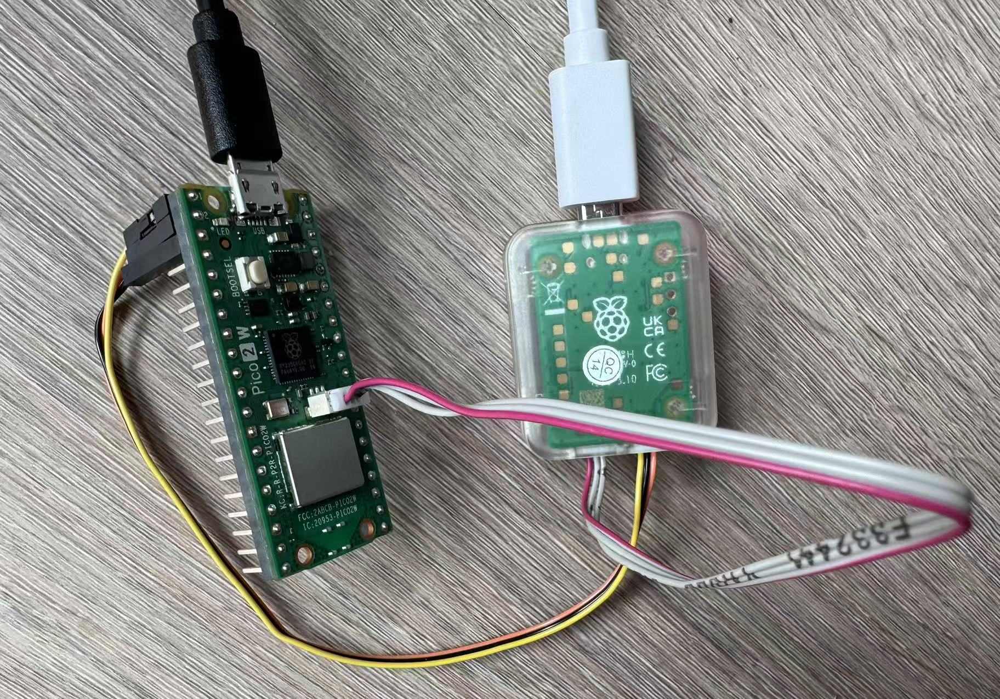

# etm-trace-rp2350
This setup is intended to facilitate running the [etm-trace-rp2350](https://github.com/czietz/etm-trace-rp2350)
repo.

## Requirements
* Raspberry Pi Pico 2 W
* Raspberry Pi Debug Probe
* Ubuntu machine 
* USB cables for Pico and Debug Probe
* 3-pin JST-SH cables (usually comes with the debug probe)

## 1. Flash Firmware for Pico 2 W
Follow the [pico 2w setup](/pico-2w).

## 2. Install OpenOCD on Ubuntu
As of July 2025, the official openocd version 0.12.0 does not support rp2350 
configuration automatically. Since Pico 2 W features rp2350, download the latest
openocd from github and install it.

1. Install dependency (some might be redundant):
```
sudo apt install libtool libusb-1.0-0-dev libftdi1-dev autoconf automake texinfo pkg-config
```

2. Clone and build openocd
```
git clone --recurse-submodules https://github.com/raspberrypi/openocd.git --depth=1
cd openocd
./bootstrap
./configure --enable-ftdi --enable-internal-jimtcl
make -j$(nproc)
sudo make install
```

3. Connect Debug Probe 
Follow the [official doc](https://www.raspberrypi.com/documentation/microcontrollers/debug-probe.html#serial-connections) to 
* Connect Raspberry Pi Debug Probe with Pico 2 W using 3-pin JST-SH cables
* Connect Raspberry Pi Debug Probe to Ubuntu machine with an USB cable
* Power Pico 2 W with an USB cable
An example:


4. Debug with OpenOCD
As of July 2025, openocd needs to be built from source in order to include the
support for rp2350 which is used by Pico 2 W. Make sure this is done in Step 2.

1. Go to the openocd directory, run the command below. 
The openocd command suggested by the [official doc](https://www.raspberrypi.com/documentation/microcontrollers/debug-probe.html#standalone-program-upload) is slightly different, since 
the official doc assumes the openocd to be installed system-wide.
```
sudo src/openocd -s tcl -f interface/cmsis-dap.cfg -f target/rp2350.cfg -c "adapter speed 5000"
```


